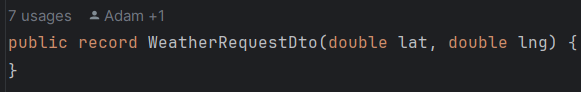

# Aplikacja do sprawdzania pogody

## Frontend

## Backend
### Kontrolery
### WeatherController 

Klasa kontroler, zawierająca endpointy do komunikacji z frontendem
#### findWeather

Endpoint udostępnoiny na porcie localhost:8080/weather, metoda get. Przyjmuje obiekt klasy WeatherRequestDto,
mapuje go do obiektu klasu WeatherRequest i przekazuje do funkcji findWeather z serwisu WeatherService.
Zawraca ReponseEntity z WeatherResponse i statusem HTTP.

### Modele
#### WeatherRequestDto

Klasa zawierająca dwa inty, będące koordynatami interesującej nas lokalizacji. Jest to data transfer
object, co oznacza, że w razie gdy api z fornt endu się zmieni, nie będziemy musieli ruszać logiki
w naszych serwisach, wystarczy przemapować tą klasę odpowiednio na WeatherRequest. Jest to tylko
klasa przejściowa.

#### WeatherRequest

Klasa zawierająca dwa inty, będące koordynatami interesującej nas lokalizacji. Operujemy na niej
w porcesie zdobywania informacji o pogodzie

#### WeatherResponse

### Serwisy
### WeatherService
